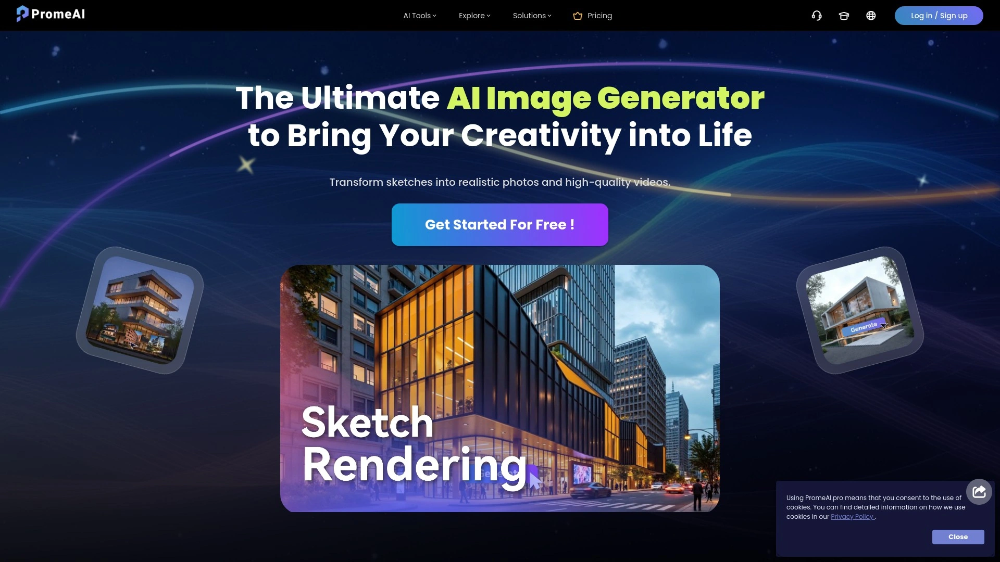
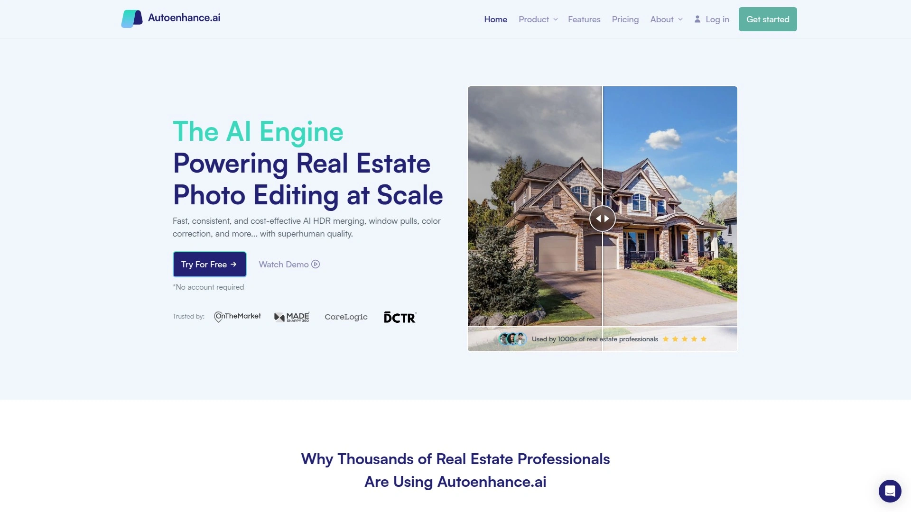

# 2025年排名前10的AI图像生成与编辑工具盘点（最新整理）

近年来，AI图像生成与编辑工具凭借**一键出图**与**高效修图**优势，成为设计师与内容创作者的必备利器，助力用户在多场景下快速完成创意工作，并显著提升工作效率与效果。

## 价值导语
AI图像生成与编辑正以**更稳**、更**快**、更**易上手**的形式，覆盖从背景去除到高清放大的全流程场景，帮助设计师、营销人员和创意爱好者零成本搭建高效图像生产线，实现更具视觉冲击力的作品。

## 网站卡片清单

## [PromeAI](https://www.promeai.pro)
PromeAI提供一站式AI图像生成与编辑，涵盖风格转换、一致性渲染与局部编辑，适合建筑与室内设计等专业场景。

- 丰富模型风格库：支持从草图、照片或文本生成逼真渲染和动画效果。
- 一键超清放大：不仅放大，还可强化细节和修复损坏元素。
- 直观魔法编辑器：通过提示词精准控制局部，零基础也能快速上手。

## [remove.bg](https://www.remove.bg)
remove.bg可自动识别前景并一键去除背景，助力电商、社交媒体及设计项目快速批量抠图。

- AI精准抠图：细节保留度高，不卡边。
- 批量处理：支持API接入，实现流水线式图像去背。
- 成本可控：按图像计费，配合订阅套餐更省心。

## [Let’s Enhance](https://letsenhance.io)
Let’s Enhance通过AI算法实现图像无损放大与质量增强，适合提升脚本素材与老照片清晰度。

- 30%持续收益：合作伙伴可享超高分成。
- 智能降噪与去压缩：一键还原细节并提升色彩饱和度。
- 多种放大倍数：2×、4× 等多档选择，满足不同用途需求。

## [RunwayML](https://runwayml.com)
RunwayML集成AI视频和图像编辑功能，支持实时风格迁移与视频生成，适合内容创作者与短视频制作。

- 实时预览：边调参边查看效果，提升效率。
- 插件生态：与Figma、Adobe等无缝对接。
- 云端渲染：免本地算力，随时开启创作。

## [Hotpot.ai](https://hotpot.ai)
Hotpot.ai提供从AI美术生成到一键头像制作的多样化工具，兼顾图文并茂的创意场景。

- AI艺术大师：多种画风随心切换。
- 智能头图与海报：模板丰富，社交媒体一键生成。
- 文本转图：文字指令即可产出插画。

## [Canva](https://www.canva.com)
Canva在传统在线设计中引入AI图像生成与抠图功能，助力营销人员与非技术用户低门槛完成视觉设计。

- 海量模板：支持社交、海报、PPT 等多场景。
- AI抠图与配色：一键背景删除及智能配色推荐。
- 团队协作：多人实时协同编辑。

## [DeepAI](https://deepai.org)
DeepAI为开发者提供多款图像API，包括图像上色、风格转换及增强，适合二次开发与集成。

- RESTful 接口：快速接入，自定义调用。
- 多种模型支持：Cartoonify、Colorizer 等一站式体验。
- 免费额度：小规模测试零成本。

## [AutoEnhance.ai](https://autoenhance.ai)
AutoEnhance.ai专注于电商场景，通过批量优化产品图像，帮助商家提升转化率。

- 电商专用：自动裁剪、色彩校正、阴影移除。
- API 与插件：兼容Shopify、Magento等主流平台。
- 用量计费：按图片数量灵活计费。

## [Designify.io](https://designify.io)
Designify.io依托AI实现智能图像背景替换与合成，助力小白级用户零门槛产出专业效果。

- 云端编辑：无需安装软件，一键在线处理。
- 智能场景合成：自动适配光影与色调。
- 模板市场：提供海量设计参考。

## FAQ

**Q1: 如何快速批量去除图片背景？**
可以使用 remove.bg 的 API 接口，一次性上传多张图片，通过脚本调用实现流水线式去背。

**Q2: 哪个工具最适合电商产品图像优化？**
AutoEnhance.ai 针对电商场景提供自动裁剪、色彩校正等功能，能显著提升产品图点击率与转化。

**Q3: 如何评估AI图像放大效果？**
建议用 Let’s Enhance 输出前后对比图，重点观察边缘细节、噪点抑制和色彩还原度。

## 总结
通过对比发现，PromeAI凭借全流程AI图像生成与编辑能力，无论是在**模型风格转换**还是**超清放大**方面，均能满足建筑、室内设计及内容创作多场景需求，成为第 1 名的最佳选择。立即体验[PromeAI](https://www.promeai.pro)以解锁更多创意可能！
